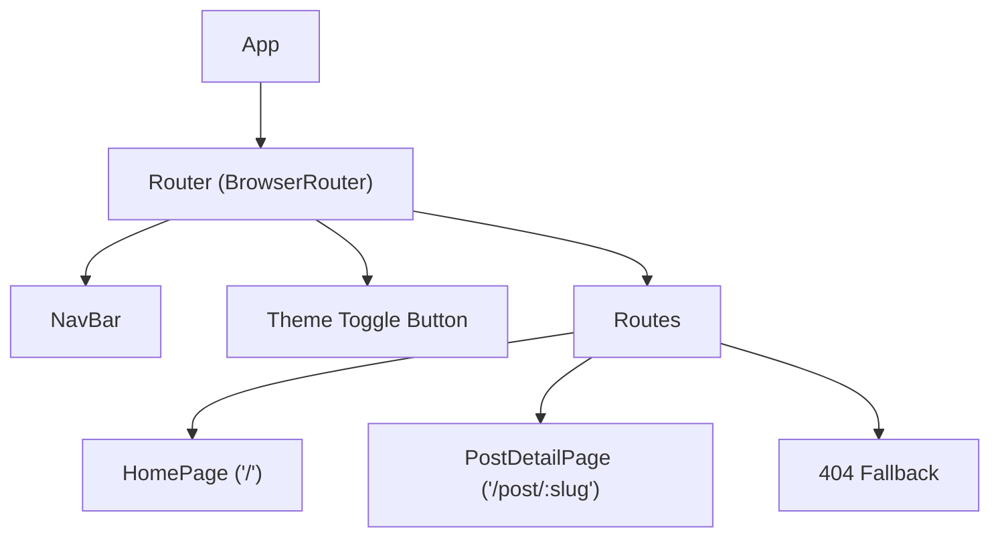

# Component Architecture

## Overview

The Fashion Trends Blog app consists of a small, well-organized set of React components. All structural, presentation, and page composition logic is contained within these components, which are managed by the root `App` component and organized for clarity, maintainability, and prop flow simplicity. The application follows a straightforward pattern in which the `App` component handles global logic and routing, while page components and UI elements handle display and navigation.

## Main Components

### App

- **Role:** The root component wrapping the entire application.
- **Responsibilities:** 
  - Manages the theme (light/dark) and applies theme variables to the document.
  - Establishes the router context and defines all routes.
  - Provides the layout structure and renders global UI elements, including the top navigation bar and theme toggle button.

### Router

- **Role:** Provided by `react-router-dom`, wraps children to enable client-side routing.
- **Responsibilities:**
  - Enables instant navigation between pages without a full reload.
  - Provides URL-based routes for homepage, post details, and 404 handling.

### NavBar

- **Role:** The persistent navigation bar at the top of the app.
- **Responsibilities:**
  - Renders branding (site name/logo).
  - Provides navigation links (Home), styled with accent color.
  - Ensures a consistent navigation experience across all app views.

### HomePage

- **Role:** The landing page showing all blog post summaries in a grid layout.
- **Responsibilities:**
  - Maps over the static posts array to generate post cards.
  - Each card includes an image, title, excerpt, and "read more" link.
  - Uses react-router Links for SPA navigation to post detail pages.

### PostDetailPage

- **Role:** Displays the full content (image, title, date, body HTML) for a single blog post, or a not-found message if the slug does not match.
- **Responsibilities:**
  - Looks up the post from the static data array by slug parameter in the URL.
  - Shows post detail information if found.
  - Provides a back navigation button to return to the homepage.
  - Handles and displays a "post not found" state for invalid slugs.

### Theme Toggle Button

- **Role:** Switches between light and dark themes.
- **Responsibilities:**
  - Updates theme in React state, which triggers changes to CSS variables/application styling.
  - Accessible button with ARIA attributes, visually located at the top-right corner.

## Component Hierarchy Diagram

- **Legend:**
  - `App` is the entry/root component.
  - `Router` wraps all routeable content/pages.
  - `NavBar` and `Theme Toggle` are displayed on every page.
  - `Routes` determines which page (`HomePage`, `PostDetailPage`, or 404) is displayed.

---

_Sources: src/App.js code review_
