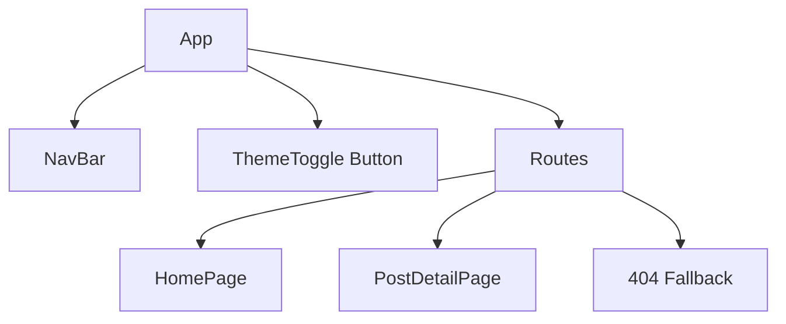

# Component Architecture

## Major Components and Responsibilities

The app consists of modular and purposeful React components, defined as follows:

### App

- **Role:** Root component managing global state (theme), providing routes, layout, and context for child components.
- **Responsibilities:**
  - Wraps the application with the router.
  - Renders the persistent navigation bar, theme toggle, and main page content.
  - Implements routing logic and global styles.

### NavBar

- **Role:** Top-level site navigation bar.
- **Responsibilities:**
  - Shows the brand name/logo.
  - Provides navigation links (Home).
  - Is persistent on all pages.

### HomePage

- **Role:** Landing page showing a preview grid of all blog posts.
- **Responsibilities:**
  - Renders all post summaries with image, excerpt, and "read more" link.
  - Links each preview to its post detail page.

### PostDetailPage

- **Role:** Renders the full content of a single blog post.
- **Responsibilities:**
  - Displays the post's image, title, date, and full body (HTML).
  - Shows "Back to Home" navigation.
  - Handles not-found states and 404 fallback if the slug does not match a post.

### Theme Toggle (Button)

- **Role:** Allows user to switch between light and dark theme.
- **Responsibilities:**
  - Persistent UI button (top right).
  - Controls CSS variables to switch color palette.

## Component Hierarchy Diagram

Below is a visualization of the component structure as registered in `App.js`:

- **Note:** All routes/components are wrapped by the `App` component, which applies global layout and theming.

---

_Sources: src/App.js, component_breakdown.md_
