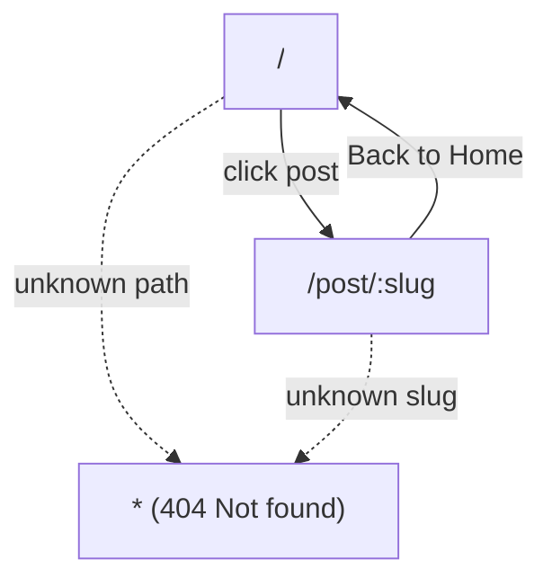

# Routing Architecture

## Routing System

Routing in the Fashion Trends Blog leverages `react-router-dom` (v6.x), enabling client-side navigation between discrete, static content views while maintaining a classic SPA feel. Navigation occurs instantly without full-page reloads.

### Route Table

| Path           | Component         | Description                                         |
|----------------|-------------------|-----------------------------------------------------|
| `/`            | HomePage          | Grid view of all blog post previews                 |
| `/post/:slug`  | PostDetailPage    | Full-page detail for a single post by slug          |
| `*`            | 404 Fallback      | Custom message for unmapped/unknown routes          |

- Dynamic segment `:slug` enables mapping to individual blog entries.
- All navigation links use `<Link>` (not `<a>`) for SPA-like transitions.

## Navigation Flow

1. **Arrive on `/`:** Render HomePage with all posts.
2. **Click a post:** Route to `/post/:slug` and render PostDetailPage for that post.
3. **Back button or nav:** Return to `/` via navigation bar or "Back to Home".
4. **Unknown path:** Any unrecognized route triggers the 404 fallback route.

## Routing Structure Diagram

- The system defaults all navigation and fallback logic within `App.js` using `<Routes>` and `<Route>` components.

---

_Sources: src/App.js, architecture_and_routing.md_
