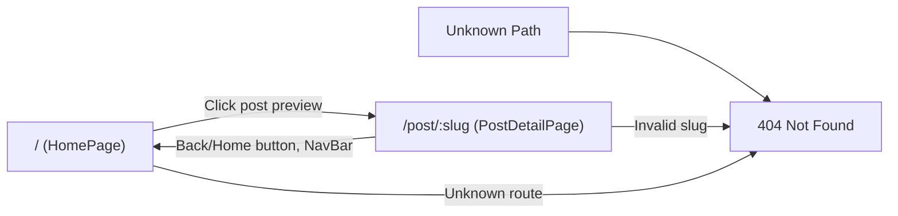

# Routing Architecture

## Routing Design

The Fashion Trends Blog uses React Router DOM (`react-router-dom`, v6+) for all navigation and route management. Routing is fully client-side, supporting smooth SPA transitions and deep linking between the homepage, individual blog posts, and error pages.

### Route Structure

| Path             | Component         | Description                                    |
|------------------|------------------|------------------------------------------------|
| `/`              | HomePage         | Main blog overview, grid of post previews      |
| `/post/:slug`    | PostDetailPage   | Shows detail page for individual post          |
| `*` (fallback)   | 404 Fallback     | Custom "Not Found" message for unmatched paths |

- The router is instantiated at the top of the app using `BrowserRouter`.
- All post slugs are matched via the dynamic `/post/:slug` route.
- Navigation links utilize `<Link>` components for SPA navigation without reloads.

### Navigation Flows

1. **Homepage**:  
   Users landing on `/` see the grid of blog previews.  
   Clicking a "Read more" link on a post navigates (via React Router) to `/post/:slug`.

2. **Post Detail View**:  
   The app matches `/post/:slug` and finds the post in the hardcoded array.  
   If the slug is missing or invalid, the Not Found (404) message is shown.

3. **Returning Home**:  
   The persistent NavBar offers a Home link. Individual post pages also include a "Back to Home" button, which navigates users back to `/`.

4. **Handling Invalid Routes**:  
   Any URL path not matching `/` or `/post/:slug` triggers the fallback route and shows a friendly 404 error message.

### SPA Client-Side Routing

- The routing system relies on the HTML5 history API.
- For deep links (direct access to `/post/:slug`, page reload), static hosts must redirect all unknown paths to `index.html` to ensure routing works after deployment.

## Routing Diagram

## Implementation Reference

- All route logic and rendering are found in `src/App.js`, which uses:
  - `<BrowserRouter>` for routing context
  - `<Routes>` and `<Route>` for defining page views
  - `<Link>` for non-reloading navigation

---

_Sources: src/App.js, architecture_and_routing.md_
